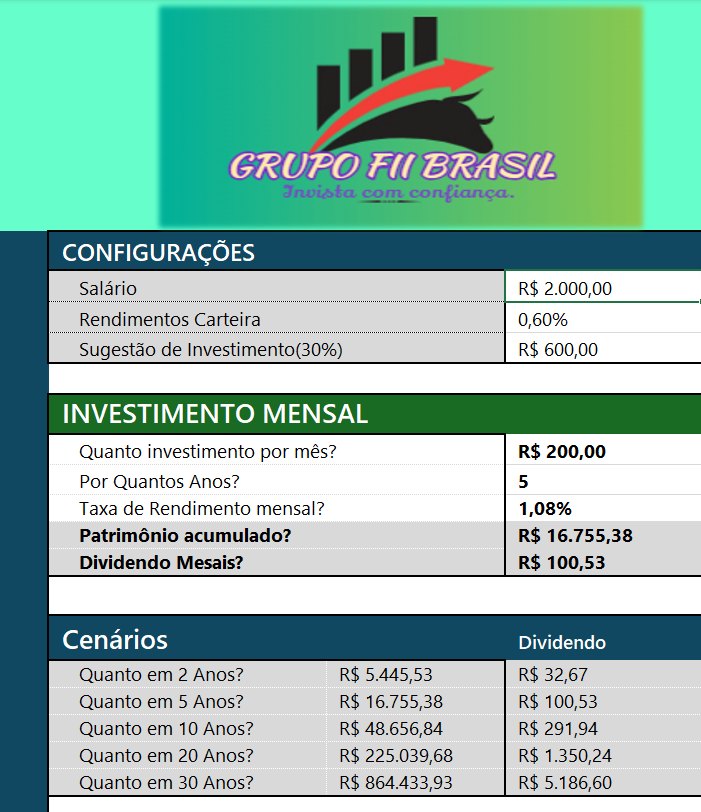
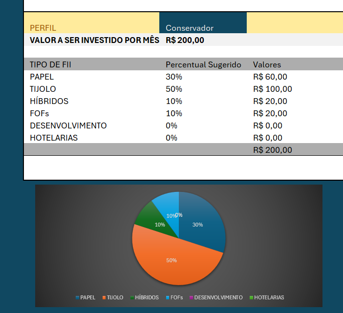

# Trabalho Bootcamp Dio – Planilha de Fundos Imobiliários

Este repositório contém o trabalho desenvolvido durante o Bootcamp da Dio. O projeto consiste em uma análise e organização dos dados de Fundos de Investimento Imobiliário (FIIs), com o objetivo de auxiliar na visualização e interpretação de informações relevantes deste mercado.

## Índice

- [Contexto](#contexto)
- [Imagem do Projeto](#Imagens-do-Projeto)
- [Descrição do Projeto](#descrição-do-projeto)
- [Conteúdo da Planilha](#conteúdo-da-planilha)
- [Ferramentas Utilizadas](#ferramentas-utilizadas)
- [Como Executar](#como-executar)
- [Conclusão](#conclusão)
- [Contato](#contato)

## Contexto

O projeto foi desenvolvido como parte do Bootcamp da Dio, com foco em aprimorar habilidades relacionadas ao Excel e à análise de dados. Durante o curso, foram abordados conceitos de manipulação e visualização de dados, que foram aplicados na construção de uma planilha customizada para acompanhamento e análise dos Fundos de Investimento Imobiliário.

## Imagens do Projeto

## Descrição do Projeto

A planilha foi criada para ajudar investidores e interessados no mercado de FIIs a:
- Organizar informações relevantes de forma clara e intuitiva.
- Analisar indicadores importantes dos fundos, como rentabilidade, rendimento de dividendos entre outros (os indicadores específicos podem ser customizados conforme as necessidades do usuário).
- Facilitar a tomada de decisão baseada em dados, através de gráficos, tabelas e resumos estatísticos.

## Conteúdo da Planilha

A planilha de fundos imobiliários contempla os seguintes elementos:

- **Dados cadastrais dos FIIs:** Informações essenciais como nome,tipo e setor.
- **Indicadores financeiros:** Rentabilidade, rendimento de dividendos, P/VP e outros índices que ajudam a medir o desempenho dos fundos.
- **Análise gráfica:** Visualizações que demonstram o comportamento dos fundos ao longo do tempo.

## Ferramentas Utilizadas

- **Microsoft Excel:** Para a criação e manipulação da planilha.
- **Recursos do Bootcamp Dio:** Conteúdos e práticas que permitiram a aplicação dos conhecimentos adquiridos durante o curso"Santander - Excel com Inteligência Artificial".
- **Técnicas de Análise de Dados:** Aplicadas para a organização e interpretação das informações referentes aos Fundos de Investimento Imobiliário.

## Como Executar

Para visualizar e trabalhar com a planilha, siga os passos abaixo:
1. Faça o download do arquivo da planilha.
2. Abra-o no Microsoft Excel ou em outro editor compatível com arquivos .xlsx.
3. Navegue pelas abas para conferir os dados, gráficos e análises realizadas.
4. Caso deseje atualizar os dados ou adicionar novos indicadores, edite as células conforme necessário.

## Conclusão

A realização deste projeto foi fundamental para colocar em prática os conhecimentos adquiridos durante o curso, principalmente na manipulação de dados e uso de ferramentas avançadas do Excel. 

## Contato

Caso tenha dúvidas ou queira discutir melhorias para o projeto, sinta-se à vontade para entrar em contato:
- **Email:** adilsontidre80@gmail.com
- **LinkedIn:** [@Adilson_tidre](https://www.linkedin.com/in/adilson-tidre-dos-santos-3a3a012b2)

---

*Este projeto foi desenvolvido com empenho e dedicação, refletindo o aprendizado obtido no Bootcamp da Dio.*
